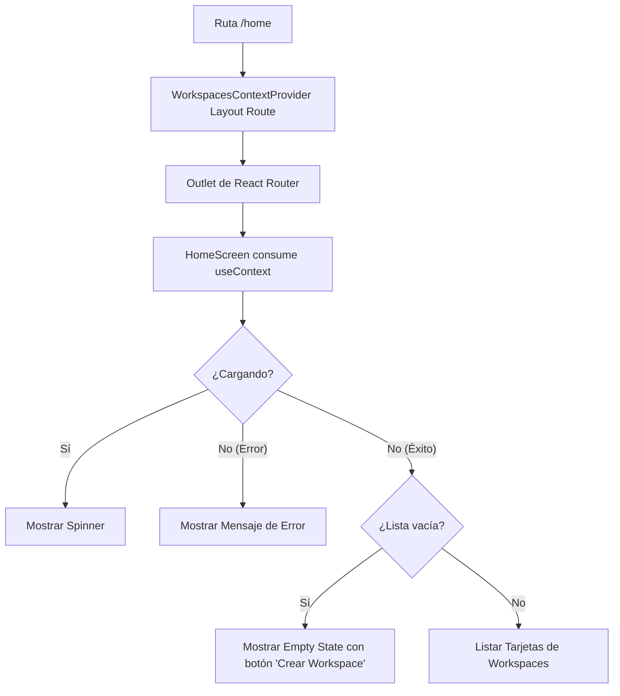

# Plan de Implementación Frontend: Listado de Espacios de Trabajo con Contexto Dedicado

Este documento detalla el diseño conceptual (shaping), requerimientos técnicos y la propuesta de código para integrar y visualizar los **Espacios de Trabajo (Workspaces)** de un usuario autenticado utilizando un contexto dedicado (`WorkspacesContext`) a nivel de ruta (layout route).

---

## 🗺️ 1. Contexto y Flujo de Usuario (Shaping)

Actualmente, tras el inicio de sesión exitoso, el usuario es redirigido a `HomeScreen`. El objetivo es transformar la pantalla de inicio en un **Selector de Espacios de Trabajo**, separando la lógica de consulta y almacenamiento del listado de workspaces en un contexto dedicado.

### Flujo de Datos con Contexto Dedicado
1. **Layout Route a nivel de ruta**: Se configura en `App.jsx` una ruta que renderiza el `WorkspacesContextProvider`. Éste expone el contexto y renderiza un `<Outlet />` de `react-router` para sus rutas hijas.
2. **`WorkspacesContext`**: 
   - Al montarse, recupera el token de sesión utilizando `AUTH_TOKEN_LOCALSTORAGE_KEY` importada de `AuthContext.jsx`.
   - Lanza la consulta `GET /api/workspace` al servidor a través de la función de servicio.
   - Administra el estado global para los workspaces de la ruta (`workspaces`, `loading`, `error`, y una función `refetch` para volver a cargar).
3. **`HomeScreen`**: Renderizada como hija de la ruta layout de workspaces, consume directamente `WorkspacesContext` para renderizar el listado, los estados de carga o los errores.



---

## 📋 2. Requerimientos Técnicos

1. **Importación de Clave de Sesión**:
   - Para evitar inconsistencias con la clave del token en localStorage, se debe importar la constante `AUTH_TOKEN_LOCALSTORAGE_KEY` desde `src/context/AuthContext.jsx` en lugar de usar un string literal hardcodeado.

2. **Creación del Contexto de Workspaces (`src/context/WorkspacesContext.jsx`)**:
   - Debe proveer el estado completo de los espacios de trabajo (`workspaces`, `loading`, `error` y la función `refetch`).
   - Utilizará el hook `useRequest` internamente para administrar el ciclo de vida de la petición.
   - Al ser usado a nivel de ruta, el componente `WorkspacesContextProvider` debe importar `Outlet` de `react-router` y renderizarlo dentro de su Provider.

3. **Creación del Servicio API (`src/services/workspaceService.js`)**:
   - Debe implementar la llamada HTTP a `GET /api/workspace`.
   - Recuperará el token de `localStorage` mediante `AUTH_TOKEN_LOCALSTORAGE_KEY`.

4. **Integración en Rutas (`src/App.jsx`)**:
   - Envolver las rutas hijas bajo `/home` (o la misma ruta `/home`) utilizando la sintaxis de rutas de diseño (Layout Routes) de React Router con `WorkspacesContextProvider`.

---

## 💻 3. Propuesta de Implementación de Código

### 📄 3.1. Servicio de Espacios de Trabajo
**Ruta**: `src/services/workspaceService.js`

```javascript
import ENVIRONMENT from '../config/environment';
import { AUTH_TOKEN_LOCALSTORAGE_KEY } from '../context/AuthContext';

/**
 * Obtiene la lista de workspaces asociados al usuario autenticado.
 * @returns {Promise<Object>} Respuesta de la API con la lista de workspaces.
 */
export async function getWorkspaces() {
    const token = localStorage.getItem(AUTH_TOKEN_LOCALSTORAGE_KEY);
    
    if (!token) {
        throw new Error("No hay un token de sesión activo");
    }

    const response_http = await fetch(`${ENVIRONMENT.URL_API}/api/workspace`, {
        method: 'GET',
        headers: {
            'Authorization': `Bearer ${token}`,
            'Content-Type': 'application/json'
        }
    });

    const response = await response_http.json();

    if (!response.ok) {
        throw new Error(response.message || "Error al obtener los espacios de trabajo");
    }

    return response;
}
```

### 📄 3.2. Contexto de Espacios de Trabajo (Nivel de Ruta)
**Ruta**: `src/context/WorkspacesContext.jsx`

```jsx
import React, { createContext, useEffect } from 'react';
import { Outlet } from 'react-router';
import useRequest from '../hooks/useRequest';
import { getWorkspaces } from '../services/workspaceService';

export const WorkspacesContext = createContext({
    workspaces: [],
    loading: false,
    error: null,
    refetch: () => {}
});

export const WorkspacesContextProvider = () => {
    const { sendRequest, loading, response, error } = useRequest();

    const fetchWorkspaces = () => {
        sendRequest(getWorkspaces);
    };

    useEffect(() => {
        fetchWorkspaces();
    }, []);

    const providerValue = {
        workspaces: response?.data?.workspaces || [],
        loading,
        error,
        refetch: fetchWorkspaces
    };

    return (
        <WorkspacesContext.Provider value={providerValue}>
            <Outlet />
        </WorkspacesContext.Provider>
    );
};
```

### 📄 3.3. Configuración de Rutas (`src/App.jsx`)
Se configura el `WorkspacesContextProvider` como una ruta de diseño que envuelve `/home`.

```jsx
import React from 'react'
import { Routes, Route, Navigate } from 'react-router'
import { LoginScreen } from './Screens/LoginScreen/LoginScreen'
import { RegisterScreen } from './Screens/RegisterScreen/RegisterScreen'
import { HomeScreen } from './Screens/HomeScreen/HomeScreen'
import { ResetPasswordScreen } from './Screens/ResetPasswordScreen/ResetPasswordScreen'
import { AuthContextProvider } from './context/AuthContext'
import { WorkspacesContextProvider } from './context/WorkspacesContext'
import AuthMiddleware from './middlewares/AuthMiddleware'
import AlreadyAuthMiddleware from './middlewares/AlreadyAuthMiddleware'

const App = () => {
  return (
    <AuthContextProvider>
      <Routes>
        <Route element={<AlreadyAuthMiddleware />}>
          <Route path='/login' element={<LoginScreen />} />
          <Route path='/register' element={<RegisterScreen />} />
          <Route path='/reset-password' element={<ResetPasswordScreen />} />
          <Route path='/' element={<LoginScreen />} />
        </Route>

        <Route element={<AuthMiddleware />}>
          {/* WorkspacesContext a nivel de ruta como layout */}
          <Route element={<WorkspacesContextProvider />}>
            <Route
              path='/home'
              element={<HomeScreen />}
            />
          </Route>
        </Route>

        <Route path='/*' element={<Navigate to={'/home'} />} />
      </Routes>
    </AuthContextProvider>
  )
}

export default App
```

### 📄 3.4. Pantalla de Inicio (`HomeScreen.jsx`)
Consume los datos a través de `WorkspacesContext`.

```jsx
import React, { useContext } from 'react'
import { AuthContext } from '../../context/AuthContext'
import { WorkspacesContext } from '../../context/WorkspacesContext'
import { useNavigate } from 'react-router'
import './HomeScreen.css'

export const HomeScreen = () => {
  const { logout, userData } = useContext(AuthContext)
  const { workspaces, loading, error, refetch } = useContext(WorkspacesContext)
  const navigate = useNavigate()

  function handleLogout() {
    logout()
    navigate('/login')
  }

  return (
    <div className="home-container">
      <header className="home-header">
        <div className="user-profile">
          <span className="avatar">{userData?.nombre?.charAt(0).toUpperCase()}</span>
          <h2>Bienvenido, <strong>{userData?.nombre}</strong></h2>
        </div>
        <button className="btn-logout" onClick={handleLogout}>Cerrar sesión</button>
      </header>

      <main className="home-main">
        <div className="section-title-container">
          <h3>Tus Espacios de Trabajo</h3>
          <button className="btn-create-workspace" onClick={() => navigate('/workspace/new')}>
            + Nuevo Espacio
          </button>
        </div>

        {/* Estado de carga */}
        {loading && (
          <div className="loading-state">
            <div className="spinner"></div>
            <p>Cargando tus espacios de trabajo...</p>
          </div>
        )}

        {/* Estado de error */}
        {error && (
          <div className="error-state">
            <p>⚠️ Error: {error}</p>
            <button className="btn-retry" onClick={refetch}>Reintentar</button>
          </div>
        )}

        {/* Estado de éxito */}
        {!loading && !error && (
          <>
            {workspaces.length === 0 ? (
              // Empty State (Sin workspaces)
              <div className="empty-state">
                <div className="empty-icon">📂</div>
                <h4>No perteneces a ningún espacio de trabajo</h4>
                <p>Crea tu primer espacio para empezar a colaborar con tu equipo.</p>
                <button className="btn-primary" onClick={() => navigate('/workspace/new')}>
                  Crear un espacio de trabajo
                </button>
              </div>
            ) : (
              // Listado de workspaces
              <div className="workspaces-grid">
                {workspaces.map((membership) => {
                  return (
                    <div 
                      key={membership.member_id} 
                      className="workspace-card"
                      onClick={() => navigate(`/workspace/${membership.workspace_id}`)}
                    >
                      <div className="workspace-card-icon">
                        {membership.workspace_nombre ? membership.workspace_nombre.substring(0, 2).toUpperCase() : 'WS'}
                      </div>
                      <div className="workspace-card-info">
                        <h4>{membership.workspace_nombre}</h4>
                        <p>{membership.workspace_descripcion || 'Sin descripción'}</p>
                        <span className={`role-badge role-${membership.member_rol}`}>
                          {membership.member_rol}
                        </span>
                      </div>
                    </div>
                  );
                })}
              </div>
            )}
          </>
        )}
      </main>
    </div>
  )
}
```

---

## ✅ 4. Criterios de Aceptación y Pruebas
1. **Independencia de Contexto**: Comprobar que `WorkspacesContext` actúe como layout a nivel de ruta y se monte/desmonte solo en `/home` y rutas anidadas correspondientes.
2. **Reintentar Petición**: Presionar "Reintentar" tras un error y verificar que la función `refetch` es disparada correctamente, refrescando los datos sin necesidad de recargar la página entera.
3. **Consistencia de Clave de Sesión**: Verificar que si cambia el valor de `AUTH_TOKEN_LOCALSTORAGE_KEY` en `AuthContext.jsx`, tanto el servicio de autenticación como el de workspaces se adaptan automáticamente sin fallar.
